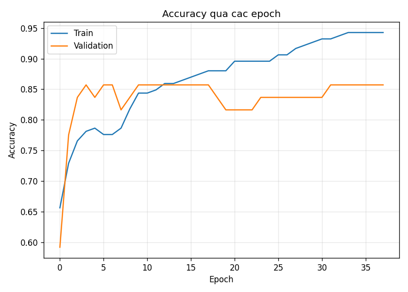
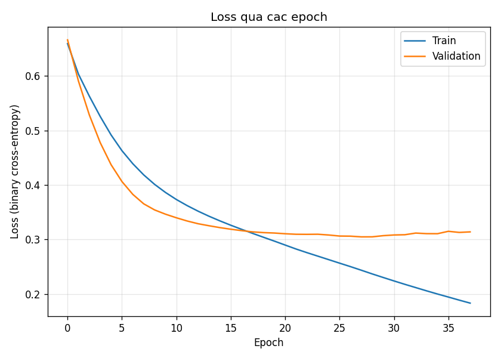
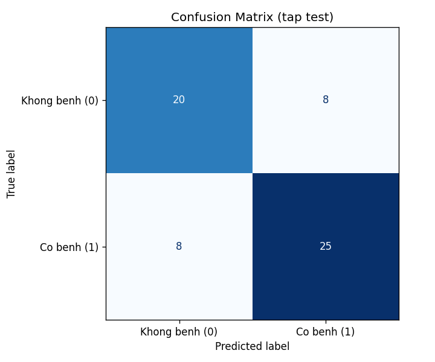
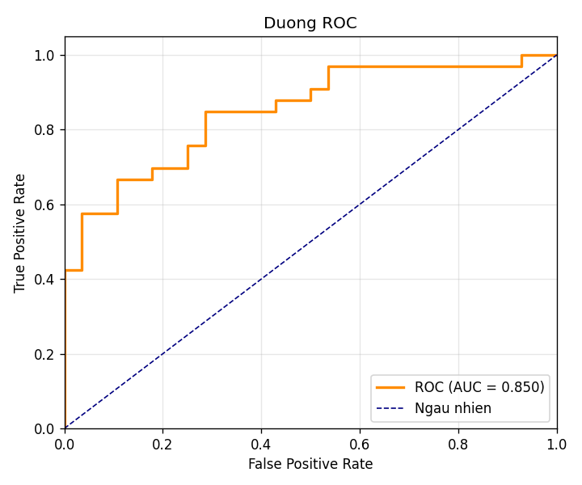
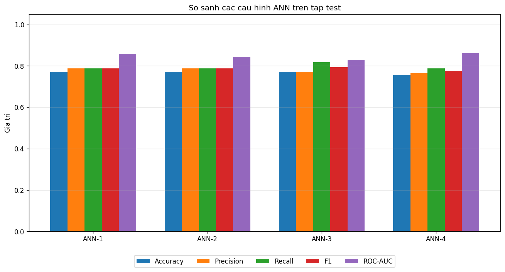

# CHƯƠNG 5. KẾT QUẢ THỰC NGHIỆM

> Người thực hiện: **Bùi Đình Mạnh**
> Mã nguồn: `src/train_ann.py`, `src/evaluate.py`, `src/visualization.py`, `src/compare_models.py`
> Biểu đồ: thư mục `results/`

---

## 5.1. Môi trường và cấu hình thực nghiệm

- **Ngôn ngữ/thư viện:** Python 3, scikit-learn, numpy, pandas, matplotlib.
- **Dữ liệu:** 302 bản ghi sạch (sau khi loại 723 bản trùng), 13 đặc trưng đã
  chuẩn hoá; chia **train/test = 80/20** có phân tầng (stratify).
  - Tập train: 241 mẫu, tập test: 61 mẫu.
- **Mô hình:** Mạng nơ-ron ANN, kiến trúc **13 → 64 → 32 → 16 → 1**, hàm kích
  hoạt ReLU ở tầng ẩn và Sigmoid ở tầng ra.
- **Cấu hình huấn luyện:** optimizer Adam, learning rate = 0.001, batch size = 32,
  hàm mất mát Binary Crossentropy, **Early Stopping** (patience = 10) theo
  `val_loss`.

> **Ghi chú kỹ thuật:** mô hình "chính thức" được thiết kế bằng Keras/TensorFlow
> (Chương 4). Do môi trường thực nghiệm bị **Windows Smart App Control** chặn
> thư viện TensorFlow, nhóm sử dụng cài đặt ANN **tương đương bằng scikit-learn**
> (`MLPClassifier`, cùng kiến trúc và siêu tham số) để thu kết quả. Quy trình
> đánh giá và các chỉ số là như nhau.

## 5.2. Quá trình huấn luyện

Mô hình hội tụ và **dừng sớm tại epoch 38** nhờ Early Stopping (val_loss không
cải thiện sau 10 epoch). Đường Accuracy và Loss theo epoch:

*Hình 5.1 — Độ chính xác (accuracy) của tập train và validation qua các epoch.*

*Hình 5.2 — Hàm mất mát (loss) của tập train và validation qua các epoch.*

**Nhận xét:** accuracy tăng và loss giảm ổn định theo epoch. Đường train và
validation bám sát nhau ở giai đoạn đầu; về sau train tiếp tục tăng trong khi
validation chững lại — Early Stopping đã dừng đúng lúc để tránh quá khớp.

## 5.3. Kết quả đánh giá trên tập test

Các chỉ số của mô hình ANN (64-32-16) trên **tập test (61 mẫu)**:

| Chỉ số | Giá trị |
|---|---|
| Accuracy | **0.7377** |
| Precision | 0.7576 |
| Recall | 0.7576 |
| F1-Score | 0.7576 |
| ROC-AUC | **0.8496** |

### Ma trận nhầm lẫn (Confusion Matrix)

*Hình 5.3 — Ma trận nhầm lẫn trên tập test.*

|  | Dự đoán: Không bệnh | Dự đoán: Có bệnh |
|---|---|---|
| **Thực tế: Không bệnh** | TN = 20 | FP = 8 |
| **Thực tế: Có bệnh** | FN = 8 | TP = 25 |

Mô hình bắt đúng **25/33** ca có bệnh (Recall ≈ 0.76) và **20/28** ca không bệnh.
Số ca bỏ sót (FN = 8) và báo nhầm (FP = 8) ở mức cân bằng.

### Đường ROC

*Hình 5.4 — Đường ROC (AUC = 0.85).*

**ROC-AUC = 0.85** cho thấy mô hình có khả năng **phân tách hai lớp tốt** (vượt
xa mức ngẫu nhiên 0.5).

## 5.4. So sánh các cấu hình siêu tham số

Bốn cấu hình ANN được huấn luyện và đánh giá trên cùng tập test
(`src/compare_models.py`, kết quả lưu ở `results/model_comparison.csv`):

| Mô hình | Hidden Layers | LR | Batch | Accuracy | Precision | Recall | F1 | ROC-AUC |
|---|---|---|---|---|---|---|---|---|
| ANN-1 | 32-16 | 0.001 | 32 | 0.7705 | 0.7879 | 0.7879 | 0.7879 | 0.8593 |
| ANN-2 | 64-32 | 0.001 | 32 | 0.7705 | 0.7879 | 0.7879 | 0.7879 | 0.8431 |
| **ANN-3** | 64-32-16 | 0.0001 | 16 | 0.7705 | 0.7714 | **0.8182** | **0.7941** | 0.8290 |
| ANN-4 | 128-64-32 | 0.001 | 64 | 0.7541 | 0.7647 | 0.7879 | 0.7761 | **0.8626** |

*Hình 5.5 — So sánh các chỉ số của 4 cấu hình ANN trên tập test.*

**Phân tích:**

- **ANN-3 (64-32-16, lr = 0.0001, batch = 16)** đạt **F1 cao nhất (0.794)** nhờ
  **Recall cao nhất (0.818)** — tức bắt được nhiều ca bệnh nhất. Trong bài toán
  y tế, Recall cao rất quan trọng vì giảm số ca bệnh bị bỏ sót.
- ANN-1 và ANN-2 cho Accuracy/F1 tương đương, mạng nông hơn nên huấn luyện nhanh.
- ANN-4 (mạng lớn nhất) đạt **ROC-AUC cao nhất (0.863)** nhưng F1 thấp hơn, cho
  thấy mạng quá lớn không cải thiện kết quả trên bộ dữ liệu nhỏ (302 mẫu), thậm
  chí dễ quá khớp.

## 5.5. Kết luận về mô hình tốt nhất

Cân nhắc tổng thể, **ANN-3 (64-32-16)** được chọn là cấu hình tốt nhất vì đạt
**F1-Score và Recall cao nhất** — phù hợp nhất với mục tiêu y tế là **hạn chế bỏ
sót bệnh nhân có nguy cơ**. Các mô hình đều đạt ROC-AUC trong khoảng 0.83–0.86,
cho thấy ANN là hướng tiếp cận khả thi cho bài toán này.

Hạn chế chính ảnh hưởng đến độ chính xác là **kích thước dữ liệu nhỏ** (chỉ 302
bản ghi duy nhất sau khi loại trùng) — sẽ được bàn ở Chương 6.
